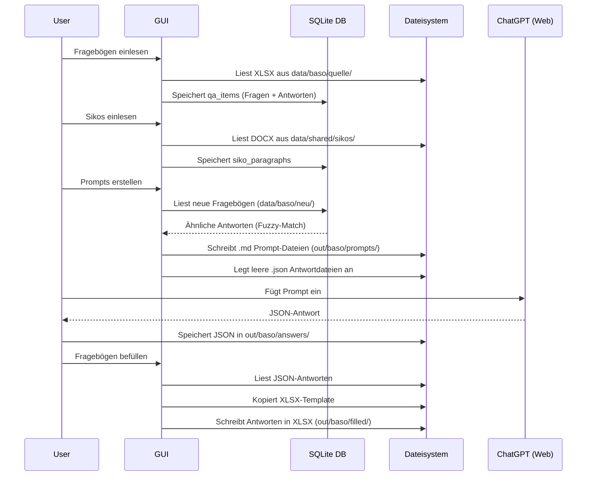
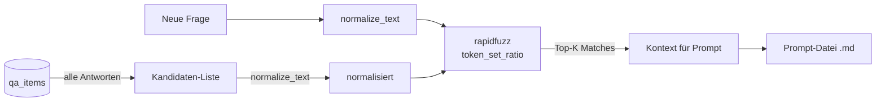
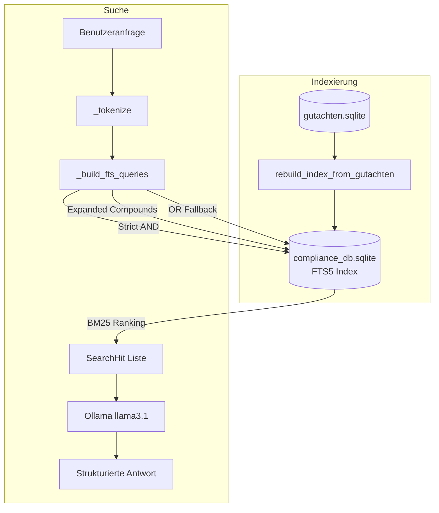
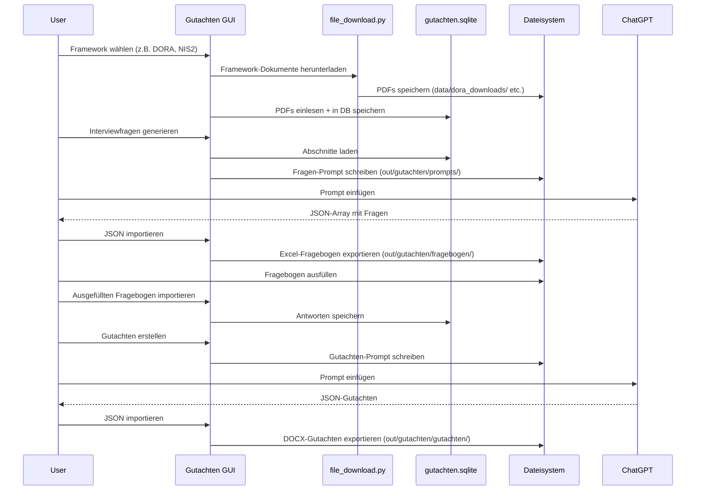
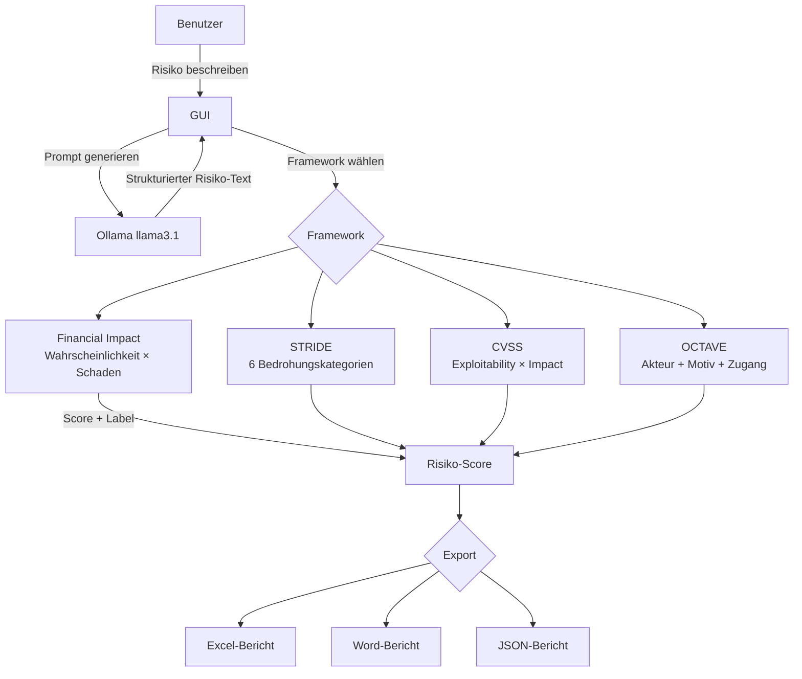
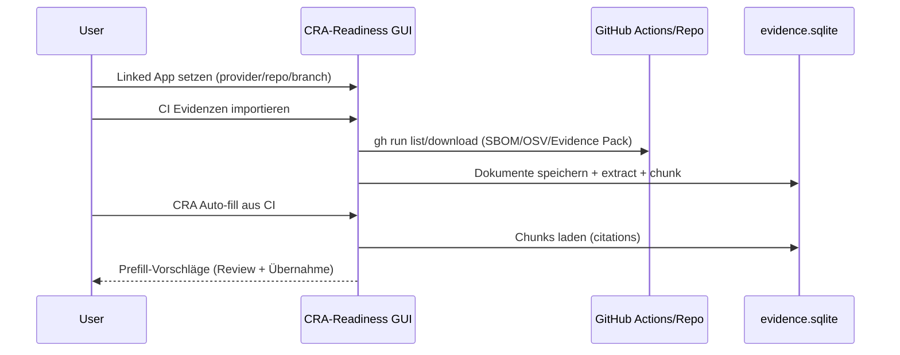
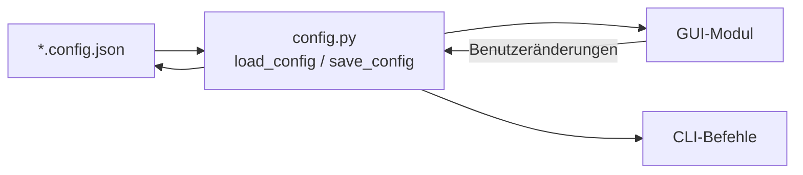

# Datenfluss

## BASO- und ICT-Workflow

---

## Ähnlichkeitssuche (Retrieval)

Beim Erstellen von Prompts sucht das System nach ähnlichen, bereits beantworteten Fragen:

`token_set_ratio` ist besonders geeignet für Fragebögen, da es unabhängig von Wortreihung und Teilmengen ähnliche Texte findet (z.B. "Verschlüsselung der Daten" vs. "Daten werden verschlüsselt").

---

## Compliance-DB: RAG-Pipeline

### Deutsche Kompositazerlegung

Die FTS5-Suche behandelt deutschsprachige Komposita durch `_expand_compound()`:

- Erkennt Fugen-s: `Datenschutzbeauftragter` → `Datenschutz + beauftragter`
- Erkennt Doppel-s: `Risikomanagement` → `Risiko + management`
- Liefert mehrere Suchanfragen für bessere Trefferquote

---

## Gutachten-Workflow

---

## Risikobewertung-Workflow

---

## CRA-Workflow (CI Evidence + Auto-fill)

---

## Konfigurationsfluss

Jedes Modul lädt seine Konfiguration beim Start:

Die JSON-Dateien liegen im Projektstamm (z.B. `baso.config.json`) und werden beim ersten Start mit Standardwerten angelegt.
