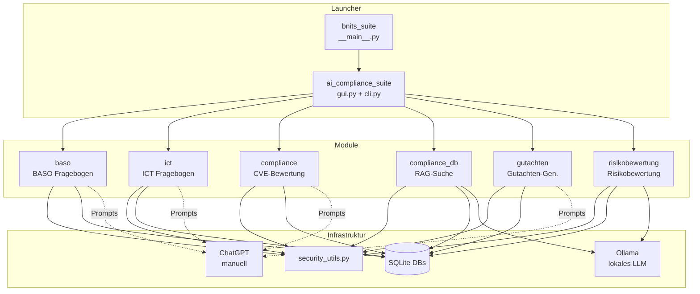
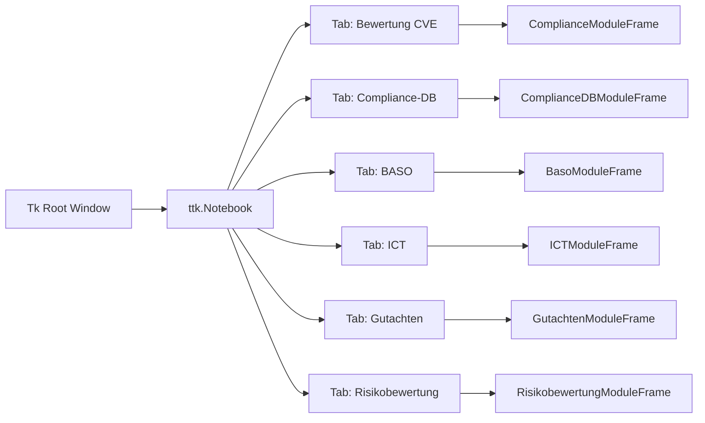

# Systemübersicht

## Modularer Aufbau

Die AI Compliance Suite besteht aus sieben Python-Paketen sowie gemeinsam genutzten Hilfsbibliotheken. Jedes Modul ist eigenständig lauffähig und wird über eine zentrale GUI integriert.



---

## Schichtenarchitektur

Jedes Modul folgt derselben internen Struktur:

```
Modul/
├── __main__.py      # Standalone-Einstiegspunkt
├── cli.py           # Kommandozeilenschnittstelle (argparse)
├── config.py        # Konfigurationsmanagement (JSON)
├── db.py            # Datenbankschema + CRUD-Operationen
├── io_xlsx.py       # XLSX-Lesen/Schreiben (openpyxl)
├── io_docx.py       # DOCX-Lesen/Schreiben (python-docx)  [optional]
├── io_pdf.py        # PDF-Extraktion (pdfplumber)          [optional]
├── prompts.py       # KI-Prompt-Generierung
├── apply_answers.py # JSON-Antworten zurückschreiben       [optional]
├── retrieval.py     # Ähnlichkeitssuche / FTS5             [optional]
└── gui_module.py    # Tkinter-UI (ttk.Frame)
```

### Schichten

| Schicht | Verantwortung | Technologie |
|---|---|---|
| **Präsentation** | Benutzeroberfläche | Tkinter / ttk |
| **Anwendungslogik** | Workflow-Orchestrierung | Python |
| **KI-Integration** | Prompt-Generierung, LLM-Calls | ChatGPT (manuell), Ollama HTTP |
| **Datenzugriff** | Lesen/Schreiben von DBs, Office-Dateien | sqlite3, openpyxl, python-docx, pdfplumber |
| **Sicherheit** | Validierung, Sanitisierung | security_utils.py |

---

## Codegrößen (LOC)

| Paket | LOC | Dateien |
|---|---|---|
| `gutachten` | ~5.540 | 9 |
| `risikobewertung` | ~3.595 | 7 |
| `baso` | ~3.313 | 9 |
| `compliance` | ~2.197 | 7 |
| `ict` | ~1.385 | 7 |
| `compliance_db` | ~1.207 | 4 |
| `ai_compliance_suite` | ~382 | 3 |
| `security_utils.py` | ~118 | 1 |
| **Gesamt** | **~17.737** | **47** |

---

## Externe Abhängigkeiten

### Python-Pakete

| Paket | Version | Zweck |
|---|---|---|
| `openpyxl` | ≥3.1.5 | XLSX-Dateien lesen und schreiben |
| `python-docx` | ≥1.2.0 | Word-Dokumente lesen und erstellen |
| `rapidfuzz` | ≥3.14.0 | Fuzzy-Textsuche (`token_set_ratio`) |
| `pillow` | ≥10.0.0 | Bildverarbeitung (Logo-Anzeige) |
| `pdfplumber` | ≥0.11.0 | PDF-Textextraktion |
| `requests` | ≥2.32.0 | HTTP-Client (Ollama API, Downloads) |

### Standardbibliothek (Auswahl)

- `tkinter` / `ttk` – GUI-Framework
- `sqlite3` – eingebettete Datenbank
- `json` – Konfiguration und Datenaustausch
- `pathlib` – plattformunabhängige Pfade
- `argparse` – CLI-Parsing
- `logging` – Debug-Ausgaben

---

## Logging & Audit Trail

Die Suite nutzt ein zentrales Logging-Setup (`shared/logging_setup.py`) mit rotierenden Logfiles.

| Log | Zweck | Standardpfad |
|---|---|---|
| `app.log` | technische Warnungen/Fehler | `logs/app.log` |
| `audit.log` | Audit-Events für kritische Aktionen (strukturiert, JSON) | `logs/audit.log` |

Audit-Events sollen **keine sensiblen Inhalte** enthalten (z.B. Tokens, Passwörter, personenbezogene Daten). Details werden vor dem Schreiben sanitisiert/gekürzt.

### Externe Dienste

| Dienst | Modul | Typ | Verbindung |
|---|---|---|---|
| ChatGPT (Web) | BASO, ICT, Compliance, Gutachten | Manuell | Kein API-Call – Prompt kopieren |
| Ollama | Compliance-DB, Risikobewertung | Automatisch | HTTP localhost:11434 |

---

## GUI-Architektur

Die Haupt-GUI (`ai_compliance_suite/gui.py`) verwendet ein `ttk.Notebook` mit einem Tab pro Modul. Jedes Modul ist als `ttk.Frame`-Unterklasse implementiert.



### Theme-System

Die Farbpalette ist aus dem Suite-Logo abgeleitet:

| Token | Light Mode | Dark Mode |
|---|---|---|
| Primärfarbe | `#0060a8` | `#1890d8` |
| Hintergrund (Panel) | `#ffffff` | `#0a1628` |
| Text | `#0a1628` | `#f0f6fc` |
| Akzent | `#1890d8` | `#3ab0f8` |

Dark Mode und Fenstergröße werden in `ai_compliance_suite.config.json` persistiert.
