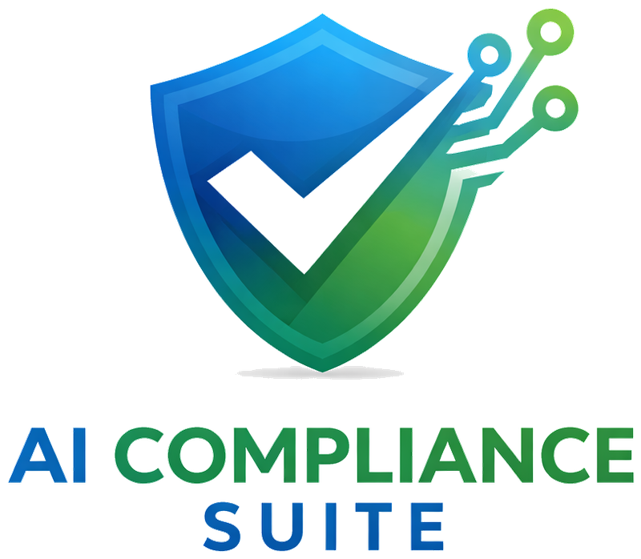

# AI Compliance Suite

<div align="center">
  
</div>

Die **AI Compliance Suite** ist eine Python-basierte Desktop-Anwendung zur KI-gestützten Bearbeitung von Compliance-Fragebögen und -Prüfungen. Sie unterstützt Sicherheitsbeauftragte und Compliance-Experten bei der effizienten Bearbeitung von BASO-, ICT-, DORA-, NIS2-, DSGVO-, CRA-, EU AI Act- und weiteren regulatorischen Anforderungen.

---

## Übersicht der Module

| Modul | Zweck | LLM-Unterstützung |
|---|---|---|
| [BASO](modules/baso.md) | BASO/ForumISM-Fragebögen (XLSX) | ChatGPT (manuell) |
| [ICT](modules/ict.md) | ICT-Framework-Fragebögen mit Reifegrad | ChatGPT (manuell) |
| [DSGVO](modules/dsgvo.md) | DSGVO-Compliance-Prüfung (TOM, VVT, Auftragsverarbeitung) | – |
| [NIS2](modules/nis2.md) | NIS2-Umsetzungsprüfung und Berichtswesen | – |
| [CRA-Readiness](modules/cra.md) | CRA-Readiness nach OWASP Proactive Controls (SbD) | optional (Auto-fill via Evidence) |
| [AI Act Readiness](modules/ai-act.md) | EU AI Act Compliance-Prüfung | optional (deterministic Prefill) |
| [Compliance Bewertung](modules/compliance.md) | CVE- und Risikoanalyse aus Quartalsberichten | ChatGPT (manuell) |
| [Compliance-DB](modules/compliance-db.md) | RAG-Suche über Regulatorik-Dokumente | Ollama (lokal) |
| [Gutachten](modules/gutachten.md) | Vollständige Compliance-Gutachten für DORA, NIS2, CRA, ISO27001 u.a. | ChatGPT (manuell) |
| [Risikobewertung](modules/risikobewertung.md) | Strukturierte Risikobewertung nach FI, STRIDE, CVSS, OCTAVE | Ollama (lokal) |
| [Kunden](modules/kunden.md) | Kundenverwaltung und Mandantentrennung | – |

---

## Schnellstart

### Voraussetzungen

- Python 3.11 oder neuer
- Tkinter (auf Linux ggf. als Systempaket zu installieren)
- Optional: [Ollama](https://ollama.com) für lokale LLM-Features (Compliance-DB, Risikobewertung)

### Installation

```bash
# Abhängigkeiten installieren
pip install -r requirements.txt

# Suite starten
python -m ai_compliance_suite
```

Unter Linux/macOS alternativ:

```bash
./start-suite.sh
```

### Einzelne Module starten

```bash
python -m baso gui           # BASO-Modul
python -m ai_compliance_suite # Vollständige Suite (alle Module)
```

---

## Architekturprinzipien

Die Suite folgt diesen Designentscheidungen:

- **Kein offizieller ChatGPT-API-Zwang** – Prompts werden manuell in ChatGPT eingefügt, JSON-Antworten zurückgekopiert. Das ermöglicht die Nutzung des ChatGPT Pro Web-Abonnements ohne API-Kosten.
- **Lokale LLM-Option** – Compliance-DB und Risikobewertung nutzen [Ollama](https://ollama.com) für vollständig offline betreibbare KI-Unterstützung.
- **SQLite-Persistenz** – Alle eingelesenen Daten, Antworten und Bewertungen werden lokal in SQLite-Datenbanken gespeichert.
- **Security-by-Design** – Umfassende Sicherheitshärtung: sichere Konfigurations-I/O ([`shared/config_io`](api/config-io.md)), restriktive Dateirechte ([`shared/fs_perms`](api/fs-perms.md)), DB-Path-Containment ([`shared/db_security`](api/db-security.md)), Runtime-Integritätsprüfung ([Integrity-Check](development/integrity-check.md)), optionale At-Rest-Verschlüsselung ([At-Rest-Encryption](development/at-rest-encryption.md)), Audit-Logging ([`shared/audit`](api/audit.md)).
- **Netzwerk-Härtung** – Cloud-KI nur nach explizitem Consent (Data-Egress-Gate) und HTTPS-only; lokale LLM-Endpunkte auf Loopback beschränkt ([`shared/net_validation`](api/net-validation.md)).
- **Mandantentrennung** – Die Nachweisbibliothek unterstützt mandantenscharfe Trennung über `kunden_id`; Zugriff auf "(Alle)" erfordert explizite Bestätigung.

---

## Projektstruktur

```
AI_Compliance_Suite/
├── ai_compliance_suite/     # Zentraler GUI-Launcher + Auth
├── baso/                    # BASO Fragebogen-Modul
├── ict/                     # ICT Fragebogen-Modul
├── dsgvo/                   # DSGVO-Compliance-Prüfung
├── nis2/                    # NIS2-Umsetzungsprüfung
├── ai_act/                  # EU AI Act Readiness
├── cra/                     # CRA-Readiness (OWASP SbD)
├── compliance/              # CVE-Risikoanalyse
├── compliance_db/           # RAG-basierte Compliance-Suche
├── gutachten/               # Gutachten-Generierung
├── risikobewertung/         # Risikobewertung (FI, STRIDE, CVSS)
├── kunden/                  # Kundenverwaltung
├── evidence/                # Nachweisbibliothek (Evidence Store)
├── vcs/                     # GitHub/GitLab Issue-Integration
├── shared/                  # Übergreifende Sicherheits-Utilities
│   ├── config_io.py         # Sichere Config I/O (SHA-256, atomisch)
│   ├── db_security.py       # DB-Path-Containment + Permissions
│   ├── fs_perms.py          # Restriktive Dateirechte (0700/0600)
│   ├── net_validation.py    # Loopback-Guard, Cloud-Egress-Gate
│   ├── json_io.py           # Sichere JSON-Importe (Größenlimit, Audit)
│   ├── redaction.py         # Secret-Redaktion (API-Keys, Tokens)
│   ├── crypto_at_rest.py    # Optionale At-Rest-Verschlüsselung
│   ├── audit.py             # Audit-Event-Logging
│   ├── integrity.py         # Runtime-Integritätsprüfung
│   └── logging_setup.py     # Infra-Logging
├── data/                    # Eingabedaten + SQLite-DBs
├── out/                     # Ausgaben (Prompts, Antworten, Berichte)
├── logs/                    # Audit-Logs
├── security_utils.py        # Sicherheits-Utilities (Office, Pfade)
├── requirements.txt         # Python-Abhängigkeiten
├── mkdocs.yml               # Diese Dokumentation
└── .github/workflows/       # CI/CD (SBOM, OSV, Docs, Evidence Pack)
```

---

## Weiterführende Dokumentation

- [Architektur & Datenfluss](architecture/overview.md)
- [Datenbankschemata](architecture/database-schemas.md)
- [CLI-Referenz](cli/index.md)
- [Konfigurationsreferenz](configuration/index.md)
- [Sicherheitsarchitektur](development/security-tooling.md)
- [Runtime-Integritätsprüfung](development/integrity-check.md)
- [At-Rest-Verschlüsselung](development/at-rest-encryption.md)
- [API-Referenz: Sicherheitsmodule](api/index.md)
- [Entwicklungsumgebung einrichten](development/setup.md)
